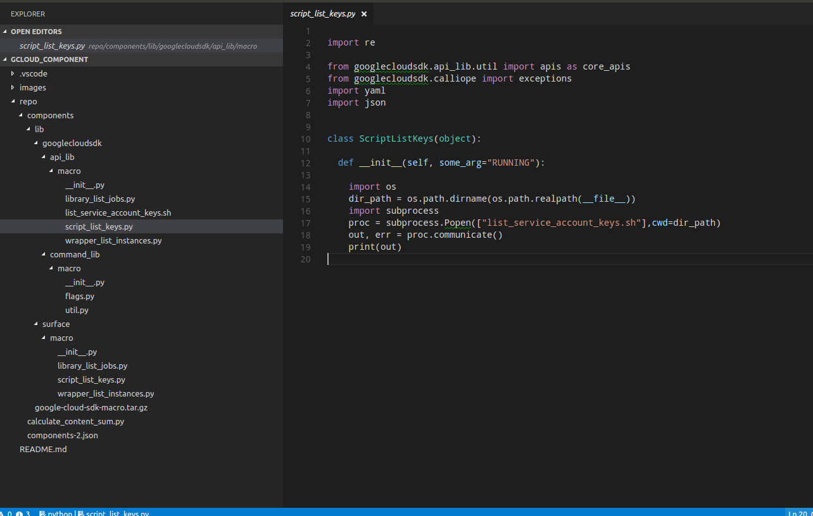

# Custom Google Cloud SDK Macro component

## Introduction

[Gcloud](https://cloud.google.com/sdk/gcloud/) is the command line interface Google Cloud Platform customers use to manage their resources.  customers
may need to exeute complex, chained or repetitive task using gcloud.  For example, the scripts described in this
[post](https://cloudplatform.googleblog.com/2016/06/filtering-and-formatting-fun-with.html) describes some techniques to script gcloud.

Large organizations may want to extend gcloud and add components that they define for specific tasks for their org with arguments they would define.

This git repo describes how users can define their own 'component' in gcloud and author scripts for various tasks.


> Note:  this is **not** supported by google and the underlying structure/folder path for scripts may change.

## Usage

Setting up the default macro component is really easy:

```
$ git clone https://github.com/salrashid123/gcloud_component.git

$ gcloud components repositories add file:///path_to/gcloud_component/repo/components-2.json

$ gcloud components install macro
WARNING: Additional component repositories are currently active.  Running `update` instead of `install`.
WARNING: You are using additional component repository: [file:///path_to/gcloud_component/repo/components-2.json]


Your current Cloud SDK version is: 163.0.0
Installing components from version: 163.0.0

┌───────────────────────────────────────────────────────┐
│           These components will be updated.           │
├────────────────────────────────┬────────────┬─────────┤
│              Name              │  Version   │   Size  │
├────────────────────────────────┼────────────┼─────────┤
│ gcloud embedded scripting tool │ 2017.07.23 │ < 1 MiB │
└────────────────────────────────┴────────────┴─────────┘

For the latest full release notes, please visit:
  https://cloud.google.com/sdk/release_notes

Do you want to continue (Y/n)?  y

╔════════════════════════════════════════════════════════════╗
╠═ Creating update staging area                             ═╣
╠════════════════════════════════════════════════════════════╣
╠═ Uninstalling: gcloud embedded scripting tool             ═╣
╠════════════════════════════════════════════════════════════╣
╠═ Installing: gcloud embedded scripting tool               ═╣
╠════════════════════════════════════════════════════════════╣
╠═ Creating backup and activating new installation          ═╣
╚════════════════════════════════════════════════════════════╝

Performing post processing steps...done.                                                                                                                                       

Update done!

```

At this point the the 'macro' gcloud component is available.

The default scripts you can run come in 3 formats though only one works currently:


* Bash Script

  - Most basic scripting primitive.  THis just runs a shell script with gcoud or other tasks built in.  This will only work on linux-like systems with bash.
  Maybe extended to powershell.

* gcloud SDK internal API

  - Runs the gcloud "SDK" API (which isn't exposed and can changed).  This allows you to script gcloud directly via python
  and return JSON objects for chained execution.

* google-cloud libraries

  - Executes [google-cloud python](https://googlecloudplatform.github.io/google-cloud-python/) library.

Here are some of the command sets and capabilities built in:

```
$ gcloud macro --help  

NAME
    gcloud macro - gcloud macro sample application; see
        https://github.com/salrashid123/gcloud_component

SYNOPSIS
    gcloud macro COMMAND [GCLOUD_WIDE_FLAG ...]

DESCRIPTION
    Gcloud macro sample application; see
    https://github.com/salrashid123/gcloud_component

GCLOUD WIDE FLAGS
    These flags are available to all commands: --account, --configuration,
    --flatten, --format, --help, --log-http, --project, --quiet, --trace-token,
    --user-output-enabled, --verbosity. Run $ gcloud help for details.

COMMANDS
    COMMAND is one of the following:

     library-list-jobs
        Lists currently running BQ jobs.

     script-list-keys
        Lists Service Account keys for all projects.

     wrapper-list-instances
        Lists GCE instances in a given running state.

```

- help options:

```
$ gcloud macro
ERROR: (gcloud.macro) Command name argument expected.
Usage: gcloud macro [optional flags] <command>
  command may be         library-list-jobs | script-list-keys |
                         wrapper-list-instances
```

- flag options

```
$ gcloud macro wrapper-list-instances --help
NAME
    gcloud macro wrapper-list-instances - lists GCE instances in a given
        running state

SYNOPSIS
    gcloud macro wrapper-list-instances --state=STATE [GCLOUD_WIDE_FLAG ...]

DESCRIPTION
    List the instances in the current project based on state

REQUIRED FLAGS
     --state=STATE
        Instance state to filter on. STATE must be one of: RUNNING, STOPPED,
        TERMINATED.

EXAMPLES
    $ gcloud macro wrapper-list-instances --state RUNNING

    [        {
          "name": "janus",
          "networkInterfaces": [
            {
              "accessConfigs": [
                {
                  "natIP": "35.193.54.213"
                }
              ]
            }
          ],
          "status": "RUNNING"
        }
    ]
```

- input validation:
```
$ gcloud macro wrapper-list-instances --state blah
ERROR: (gcloud.macro.wrapper-list-instances) argument --state: Invalid choice: 'blah'.

Valid choices are [RUNNING, STOPPED, TERMINATED].
```

- finally the output

```
$ gcloud macro wrapper-list-instances --state RUNNING
[
  {
    "name": "janus",
    "networkInterfaces": [
      {
        "accessConfigs": [
          {
            "natIP": "35.193.54.213"
          }
        ]
      }
    ],
    "status": "RUNNING"
  }
]
```

### Bash Script

The [bash script](repo/components/lib/googlecloudsdk/api_lib/macro/list_service_account_keys.sh) included in this repo simply lists out the service accounts for the default gcloud project.

Users can define additional filters/formats and even powershell scripts with the following [blog]](https://cloudplatform.googleblog.com/2016/06/filtering-and-formatting-fun-with.html)

```python
class ScriptListKeys(object):
  def __init__(self, some_arg="RUNNING"):
    import os
    dir_path = os.path.dirname(os.path.realpath(__file__))
    import subprocess
    proc = subprocess.Popen(["list_service_account_keys.sh"],cwd=dir_path)
    out, err = proc.communicate()
    print(out)

```

to execute the script, simply run:

```bash
$ gcloud macro script-list-keys
ProjectId:  mineral-minutia-820
    -> Robot mineral-minutia-820@appspot.gserviceaccount.com
        3d35242014ed0694d95c38012d81a5c7444d71f0
    -> Robot 1071284184436-compute@developer.gserviceaccount.com
        24d7bcbae63efff0accaaa7ba7fcd3aa1a5c9105
    -> Robot service-account-b@mineral-minutia-820.iam.gserviceaccount.com
        3e32db77441dd388d15c42b3b6d84f987d698757
        181e3dedfa0439789c1516bf9a4bd7ee784b4dad
        7037c6e52836cf845be68208ba41c765f59d5127
    -> Robot svc-2-429@mineral-minutia-820.iam.gserviceaccount.com
        2705030cb6d96e324fcb60be572f5e0da8fd183f
        e4536f3eed76703b7f626b2f88741be29a77f71a
        e65deccae47bed6fcaca10da66612fc63e3c56ec
        d936e98f5a9b0ea880bcce35ba60c5fd15ffad65
        04bd2d56d0cc5746b125d17f95d4b0dd654accca
        1deb44e2f54328fc7bb316e5a87315e3314f114f
        a9741789b47f55ad0496b2f13debc3455ab8aabd
```

$ gcloud iam service-accounts keys list \
   --iam-account svc-2-429@mineral-minutia-820.iam.gserviceaccount.com \
   --filter="validBeforeTime.date('%Y-%m-%d', Z)<='2019-05-28'"
KEY_ID                                    CREATED_AT            EXPIRES_AT
58a20bac0027d81b9e7453e2005dc08fa2d9352c  2018-05-22T23:01:33Z  2018-06-07T23:01:33Z
fb6ed7bf4b5072d3978b86ecfb7de7f3120cc9d2  2018-05-12T03:26:42Z  2018-05-28T03:26:42Z


### gcloud SDK internal API

This version executes the unsupported internal gcloud "API" as described here:
  - [https://github.com/salrashid123/gce_metadata_server/blob/master/gcloud_wrapper.py](https://github.com/salrashid123/gce_metadata_server/blob/master/gcloud_wrapper.py)

The script instruments the gcloud api calls to return JSON objects.  This mechanism does not work with this repo currently due to how
gcloud itself redirects and captures the stdout/stderr.   

The default script only emits/displays the output.  The parts commented out below describes how to process the stdout if gcloud someday
returns the value.

> TODO: figure out how to capture the gcloud  stdout while running the wrapper in gcloud itself.

Example:

```python
class WrapperListInstances(object):
  def __init__(self, state="RUNNING"):
    f = io.StringIO()    
    _args = ['compute','instances','list','--format','json(NAME,EXTERNAL_IP,STATUS)', '--filter', 'status=' + state]
    with stdout_redirector(f):
      _CLI = googlecloudsdk.gcloud_main.CreateCLI([])
      _CLI.Execute(args=_args)
    result = f.getvalue()
    #instances = json.loads(result)
    #for instance in instances:
    #  print (instance['name'] + " has external IP address " +
    #        instance['networkInterfaces'][0]['accessConfigs'][0]['natIP'])
```

If customer run the script as-is, the stdout is displayed but not captured into the 'result' variable:

```
$ gcloud macro wrapper-list-instances --state RUNNING
[
  {
    "name": "instance-1",
    "networkInterfaces": [
      {
        "accessConfigs": [
          {
            "natIP": "104.197.68.88"
          }
        ]
      }
    ],
    "status": "RUNNING"
  }
]

```
### Google-Cloud Libraries

This mechanism run the idomatic [google-cloud-python](https://googlecloudplatform.github.io/google-cloud-python/) script.

For example, the section below runs BQ client library to list out completed jobs.

```python
class LibraryListJobs(object):
  def __init__(self, some_arg="RUNNING"):
    from google.cloud import bigquery
    client = bigquery.Client()
    dataset = client.dataset(dataset)

    for j in client.list_jobs(state_filter=state_filter):
        if (j.job_type=='query'):
          print j.job_id
          break
```

Note, this mechanism also __does not work completely__ since gcloud cli overrides the PYTHONPATH to even prevent system-wide site-libraries/ from getting loaded.

that is, if you run the ```library-list-jobs``` macro, you'll see
```
$ gcloud macro library-list-jobs --dataset mineral-minutia-820:mydataset1 --state_filter done
...
ERROR: gcloud crashed (ImportError): No module named cloud
```

Even if the google/cloud/* is installed into those directories, google/cloud/ is namespaced and would miss the __init__.py folders
(you can copy them in but that isn't correct)


```
virtualenv  env  
source env/bin/activate
pip install google-cloud-bigquery
cp -R env/lib/python2.7/site-packages/google path-to-sdk/google-cloud-sdk/lib/third_party/
or
cp -R env/lib/python2.7/site-packages/google path_to/repo/components/lib/googlecloudsdk/api_lib/macro/
then add __init__.py to the subfolders
```


## Build

To author your own script/macro, just review the following files make a copy as suitable::

- repo/components/lib/googlecloudsdk/api_lib/macro/script_list_keys.py
- repo/components/lib/googlecloudsdk/api_lib/macro/list_service_account_keys.sh

- repo/components/lib/googlecloudsdk/command_lib/macro/flags.py

- repo/components/lib/surface/macro/script_list_keys.py

in the directory shown below:




Then to generate the .tar.gz and components:


* $ cd gcloud_component/repo/components

* tar cvzf google-cloud-sdk-macro.tar.gz lib/

      ```
      $ tar cvzf google-cloud-sdk-macro.tar.gz lib/
      lib/
      lib/surface/
      lib/surface/macro/
      lib/surface/macro/library_list_jobs.pyc
      lib/surface/macro/script_list_keys.pyc
      lib/surface/macro/script_list_keys.py
      lib/surface/macro/__init__.py
      lib/surface/macro/wrapper_list_instances.pyc
      lib/surface/macro/wrapper_list_instances.py
      lib/surface/macro/library_list_jobs.py
      lib/surface/macro/__init__.pyc
      lib/googlecloudsdk/
      lib/googlecloudsdk/command_lib/
      lib/googlecloudsdk/command_lib/macro/
      lib/googlecloudsdk/command_lib/macro/flags.pyc
      lib/googlecloudsdk/command_lib/macro/util.py
      lib/googlecloudsdk/command_lib/macro/flags.py
      lib/googlecloudsdk/command_lib/macro/__init__.py
      lib/googlecloudsdk/command_lib/macro/util.pyc
      lib/googlecloudsdk/command_lib/macro/__init__.pyc
      lib/googlecloudsdk/api_lib/
      lib/googlecloudsdk/api_lib/macro/
      lib/googlecloudsdk/api_lib/macro/library_list_jobs.pyc
      lib/googlecloudsdk/api_lib/macro/script_list_keys.pyc
      lib/googlecloudsdk/api_lib/macro/script_list_keys.py
      lib/googlecloudsdk/api_lib/macro/__init__.py
      lib/googlecloudsdk/api_lib/macro/list_service_account_keys.sh
      lib/googlecloudsdk/api_lib/macro/wrapper_list_instances.pyc
      lib/googlecloudsdk/api_lib/macro/wrapper_list_instances.py
      lib/googlecloudsdk/api_lib/macro/library_list_jobs.py
      lib/googlecloudsdk/api_lib/macro/__init__.pyc
      ```

Now you need to calculate the sha256 sum for the .tar.gz as well as the content_checksum.
> Note:  at the moment, gcloud SDK does not enforce size, content_checksum or checksum (meaning these are optional now)

* $ export PYTHONPATH=/path_to/google-cloud-sdk/lib/:$PYTHONPATH

* $ python calculate_content_sum.py
    *71dbc333fc2614efd83687361acf4a5fc9d5c4e7a5a74509f0e0aee130c27db1*

* $ ls -la google-cloud-sdk-macro.tar.gz
    -rw-r----- 1 srashid srashid 2898 Jul 23 22:40 google-cloud-sdk-macro.tar.gz

* $ sha256sum google-cloud-sdk-macro.tar.gz
    *759c7b3a2fc50a8eaa5689bd7275664bd68a9fce6733ad3e126019b1cc79e4e5*  google-cloud-sdk-macro.tar.gz

then edit the the following file and add in the values:

* components-2.json

```json
{
  "components": [
    {
      "data": {
        "checksum": "759c7b3a2fc50a8eaa5689bd7275664bd68a9fce6733ad3e126019b1cc79e4e5",
        "contents_checksum": "71dbc333fc2614efd83687361acf4a5fc9d5c4e7a5a74509f0e0aee130c27db1",
        "size": 7107,
        "source": "components/google-cloud-sdk-macro.tar.gz",
        "type": "tar"
      },
      "dependencies": [
        "core"
      ],
      "details": {
        "description": "Provides the gcloud scripting tool",
        "display_name": "gcloud embedded scripting tool"
      },
      "id": "macro",
      "is_configuration": false,
      "is_hidden": false,
      "is_required": false,
      "platform": {},
      "version": {
        "build_number": 20170723000000,
        "version_string": "2017.07.23"
      }
    }
  ],
  "revision": 20170711000025,
  "schema_version": {
    "no_update": false,
    "url": "file:///tmp/cloudsdk2/google-cloud-sdk.tar.gz",
    "version": 3
  }
}
```

At this point, just add gcloud sdk to the components-2.json file and update.

Note, if you want to upgrade, increment the build\_number and the version\_string and just tar.gz the file.
